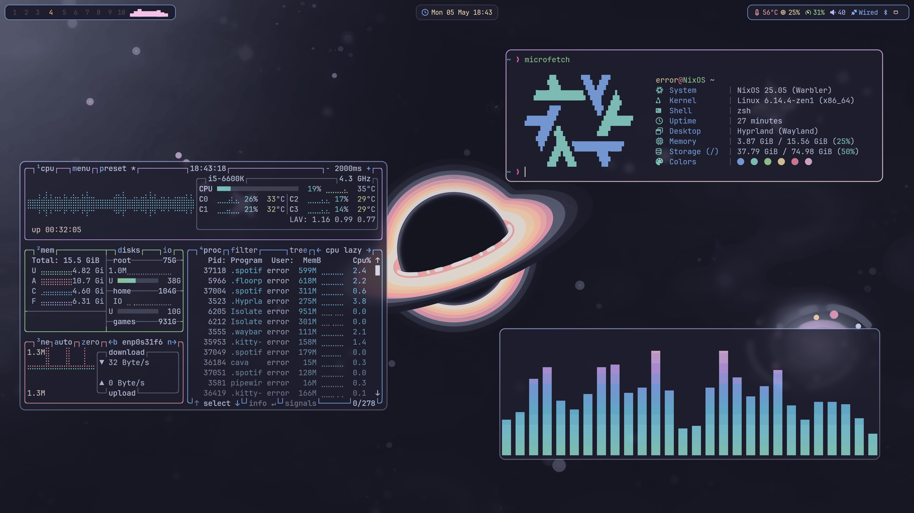
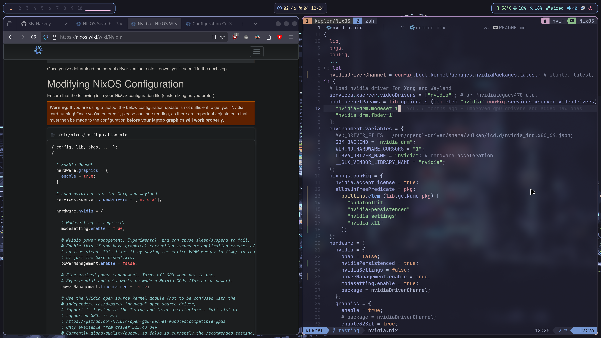
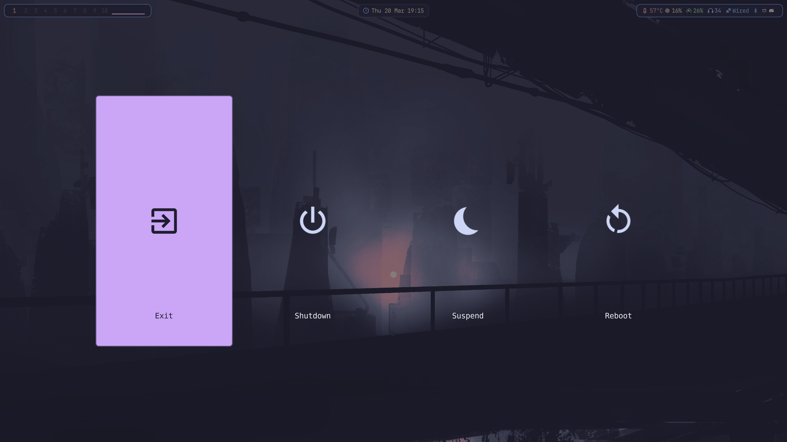
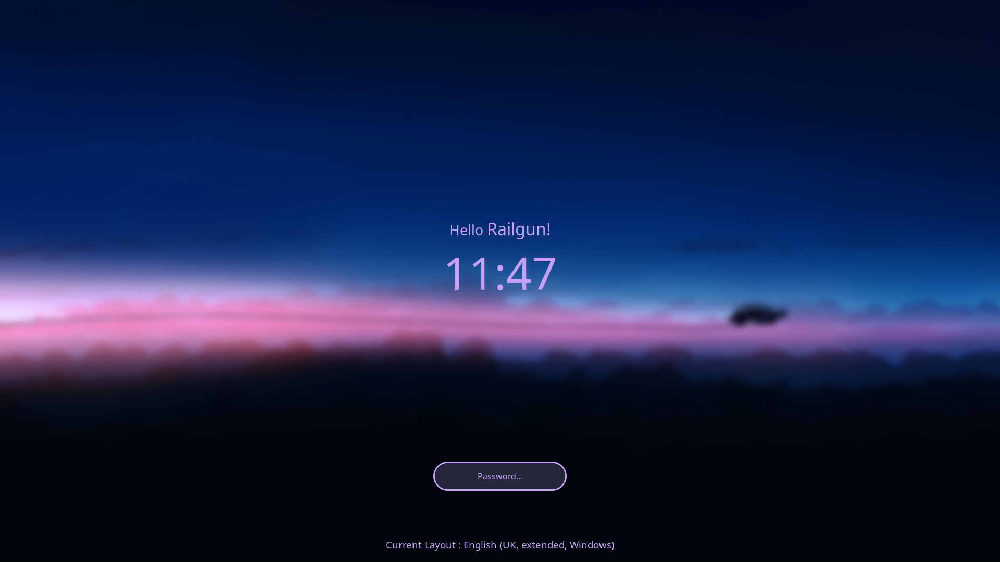

<h1 align="center">
    
   <br>
      My NixOS Configuration
   <br>
       <br>
   <div align="center">

   <div align="center">
      <p></p>
      <div align="center">
         <a href="https://github.com/Sly-Harvey/NixOS/stargazers">
            
         </a>
         <a href="https://github.com/Sly-Harvey/NixOS/network/members">
            
         </a>
         <!-- <a href="https://github.com/Sly-Harvey/NixOS/"> -->
         <!--     -->
         <!-- </a> -->
         <a = href="https://nixos.org">
            
            <!--  -->
         </a>
         <a href="https://github.com/Sly-Harvey/NixOS/blob/main/LICENSE">
            
         </a>
      </div>
      <br>
   </div>
</h1>



<details>
<summary>More Previews</summary>





</details>

## Installation
> [!Note]
> Before proceeding with the installation, review the following files to customise your setup:
> - `hosts/Default/variables.nix`: Contains host-specific variables.
> - `hosts/Default/host-packages.nix`: Lists installed packages for the host.
> - `hosts/Default/default.nix`: Defines imports for the host configuration.

<!-- You can use the `install.sh` script while booted into a system or in the live installer.<br>
If you prefer the latter, you can obtain an ISO from [here](https://nixos.org/download/#nixos-iso).<br>
The minimal ISO is recommended, but you can use any.
```bash
git clone https://github.com/Sly-Harvey/NixOS.git ~/NixOS
```
```bash
cd ~/NixOS
```
```bash
./install.sh
``` -->

You can install this configuration either on a running system or from the NixOS live installer. The minimal ISO is recommended and can be downloaded from the official NixOS website.

### Installation Steps

1. **Clone the Repository**:

   ```bash
   git clone https://github.com/Sly-Harvey/NixOS.git ~/NixOS
   ```

2. **Navigate to the Directory**:

   ```bash
   cd ~/NixOS
   ```

3. **Run the Installation Script**:

   ```bash
   ./install.sh
   ```

   <!-- The `install.sh` script automates the setup process, including partitioning, formatting, and applying the configuration. -->
   The `install.sh` and `rebuild` scripts automates the setup process, including hosts, username, and applying the configuration. It also automatically generates the hardware-configuration.nix file based on your system's detected hardware, eliminating the need to manually generate hardware-configuration.nix.

---

## Usage

### Switching or Creating Hosts

To switch to an existing host or create a new one:

1. **Automatic**: Run the installation script again to select or create another host:

   ```bash
   ./install.sh
   ```

2. **Manual**:

   - Copy the `hosts/Default` directory to a new directory (e.g., `hosts/NewHost`).
   - Modify `hosts/NewHost/variables.nix` to suit your needs.
   - Update `hosts/NewHost/host-packages.nix` to include desired packages.
   - Add the new host to `flake.nix` in the `nixosConfigurations` section, for example:

     ```nix
     nixosConfigurations = {
       Default = mkHost "Default";
       NewHost = mkHost "NewHost";
     };
     ```

   - Rebuild the system using method 3 or 4 below (specifying the new host name). Once rebuilt, any of the rebuilding methods can be used, as the host name will be implicitly recognised.

### Rebuilding the System

To apply changes or rebuild the system, use one of the following methods:

1. **Using a Keyboard Shortcut**: Press `Super + U` to trigger a rebuild.

2. **Using the `rebuild` Script in a Terminal**:

   ```bash
   rebuild
   ```

3. **Using nixos-rebuild**:

   ```bash
   sudo nixos-rebuild switch --flake ~/NixOS#<HOST>
   ```

4. **Using** `nh` **Tool**:

   ```bash
   nh os switch --hostname <HOST>
   ```

Replace `<HOST>` with the name of your host (e.g., `Default`).

### Rollback to a Generation
- List available generations in the terminal:

  ```bash
  list-gens
  ```

- Rollback to a specific generation (replace `N` with the generation number):

  ```bash
  rollback N
  ```

### Viewing Keybindings

To view configured keybindings:

- Press `Super + ?` to display the keybinding overview.
- Press `Super + Ctrl + K` same as above.

---

<!-- # Dev-shells -->
## Development Shells

This configuration includes pre-configured development shells for various programming languages and frameworks, making it easy to start new projects or work in isolated environments.

### Initialising a New Project

To create a new project from a template:

```bash
nix flake init -t ~/NixOS#<TEMPLATE_NAME>
```

To create a new project directory with a template:

```bash
nix flake new -t ~/NixOS#<TEMPLATE_NAME> <PROJECT_NAME>
```

Replace `<TEMPLATE_NAME>` with the name of a template defined in `dev-shells/default.nix` (e.g., `python`, `node`, etc.).

### Entering a Development Shell

If `direnv` is configured, navigate to the project directory, and the shell will activate automatically. Otherwise, manually enter the shell:

```bash
cd <PROJECT_NAME>
nix develop
```

---

<!-- </details> -->
<!-- <summary>Credits/Inspiration</summary> -->

### Credits/Inspiration
| Credit                                                              |  Reason                                |
|---------------------------------------------------------------------|----------------------------------------|
| [Hyprland-Dots](https://github.com/JaKooLit/Hyprland-Dots)          | Script and Waybar templates            |
| [HyDE](https://github.com/HyDE-Project/HyDE)                        | Some more useful scripts               |
| [rofi](https://github.com/adi1090x/rofi)                            | Rofi launcher templates                |
| [dev-templates](https://github.com/the-nix-way/dev-templates)       | Development templates                  |
| [Vimjoyer](https://www.youtube.com/@vimjoyer)                       | Short, simple, concise guides and info |

<!-- </details> -->

<details>
<summary>Star History</summary>
<a href="https://github.com/Sly-Harvey/NixOS/stargazers">
 <picture>
   <source media="(prefers-color-scheme: dark)" srcset="https://api.star-history.com/svg?repos=Sly-Harvey/NixOS&type=Date&theme=dark" />
   <source media="(prefers-color-scheme: light)" srcset="https://api.star-history.com/svg?repos=Sly-Harvey/NixOS&type=Date" />
   
 </picture>
</a>
</details>
