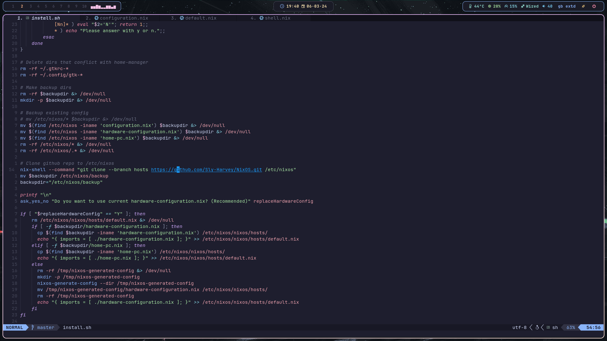

## My reproducible system



## Install

### clone the repo
```bash
nix run --experimental-features "nix-command flakes" nixpkgs#git clone https://github.com/Sly-Harvey/NixOS.git ~/NixOS
```
```bash
cd ~/NixOS
```
### then you can use the install script to install to /etc/nixos
```bash
sudo ./install.sh
```
### or you can build directly from the flake
```bash
sudo nixos-rebuild switch --flake .#nixos
```
